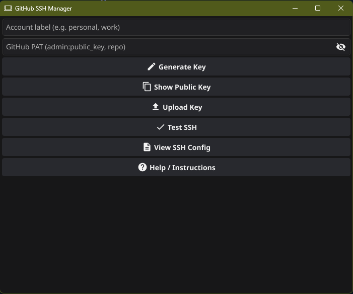
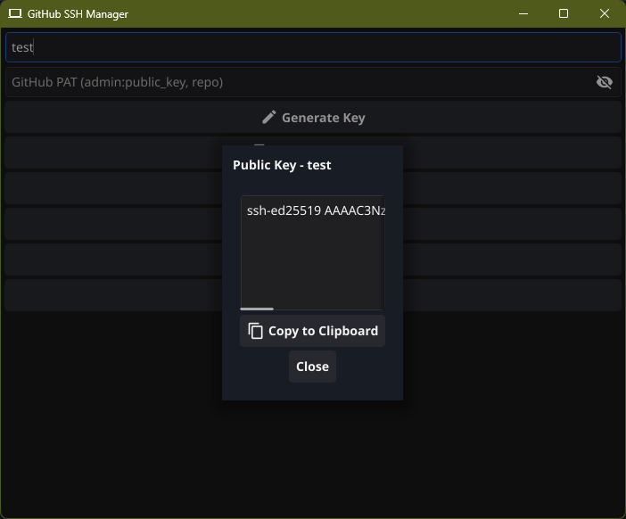
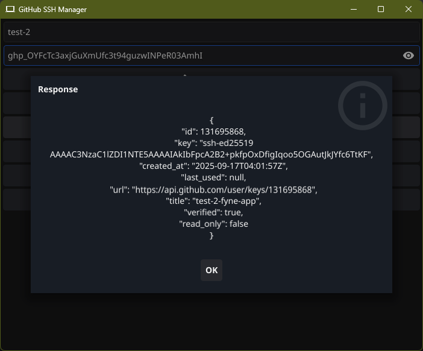

# GitHub SSH Manager

[](https://golang.org/)
[](LICENSE)
[](https://fyne.io/)

A cross-platform GUI tool built with **Go** and **Fyne** that allows you to manage multiple GitHub SSH keys effortlessly. Generate keys, view public keys, upload to GitHub, test SSH connections, and manage your `~/.ssh/config` all from one place.

---

## 📌 Table of Contents

- [Features](#features)
- [Screenshots](#screenshots)
- [Running the App](#running-the-app)
- [Compilation Instructions](#compilation-instructions)
- [Usage Instructions](#usage-instructions)
- [Dependencies](#dependencies)
- [Notes](#notes)
- [License](#license)

---

## ✨ Features

- **Generate SSH Key** – Create `ed25519` SSH keys for multiple GitHub accounts.
- **Show Public Key** – View and copy your public key to clipboard.
- **Upload Key to GitHub** – Upload your public key via a Personal Access Token (PAT).
- **Test SSH Connection** – Verify SSH connection to GitHub for each account.
- **View SSH Config** – Inspect your `~/.ssh/config` in a polished, read-only modal.
- **Multi-account Support** – Manage multiple GitHub accounts using labels.
- **Built-in Instructions** – Step-by-step instructions accessible via the Help button.

---

## 🖼️ Screenshots

### 1. Main Window


_Enter your label and PAT, then generate or manage SSH keys easily._

### 2. Public Key Viewer


_View your public key and copy it to clipboard._

### 3. SSH Config Viewer


_Inspect your `~/.ssh/config` in a clean, read-only modal._

### 4. Upload Key Response


_GitHub API response after uploading the SSH key._

---

## 🏃‍♂️ Running the App

### Prerequisites

- **Go >= 1.22**
- **Git**
- **SSH tools** (`ssh-keygen`, `ssh`)
- **cURL** (for GitHub API uploads)
- **Fyne dependencies** (handled automatically via Go modules)

### Run from Source

```bash
git clone https://github.com/Sarwarhridoy4/github-ssh-manager.git
cd github-ssh-manager
go mod tidy
go run main.go
```

The GUI window will open, allowing you to manage your GitHub SSH keys.

---

## 💻 Compilation Instructions

### Linux

```bash
GOOS=linux GOARCH=amd64 go build -o github-ssh-manager
```

### macOS

```bash
GOOS=darwin GOARCH=amd64 go build -o github-ssh-manager.app
```

### Windows

```bash
GOOS=windows GOARCH=amd64 go build -o github-ssh-manager.exe
```

> Ensure `ssh-keygen` and `ssh` are available on your PATH.

## 📦 Packaging for Desktop

Packaging a graphical app for distribution can be complex. Graphical applications typically have icons and metadata associated with them, and each platform has specific requirements:

- **Windows** – executables need embedded icons and metadata.
- **macOS** – apps are bundles with a defined folder structure.
- **Linux** – various metadata files are needed for proper installation.

Thankfully, the **Fyne** toolkit provides a `package` command that simplifies this process. You only need a built app and an icon (`.png`), and Fyne handles creating `.app`, `.exe`, and `.tar.gz` packages automatically.

### Install Fyne Tools

```bash
go install fyne.io/tools/cmd/fyne@latest
```

### Packaging Commands

#### macOS

```bash
fyne package -os darwin -icon myapp.png
```

This generates `myapp.app`, a complete bundle ready for distribution.

#### Linux

```bash
fyne package -os linux -icon myapp.png
```

Generates `myapp.tar.gz` containing a folder structure starting at `/usr/local/`.

#### Windows

```bash
fyne package -os windows -icon myapp.png
```

Generates `myapp.exe` with embedded icon and app metadata.

#### Release Builds

For smaller memory footprint and without debug symbols:

```bash
fyne package -os windows -icon myapp.png -release
```

### Installing Locally

To install your app system-wide on your computer:

```bash
fyne install -icon myapp.png
```

> Fyne also supports a default icon named `Icon.png` and a metadata file for project-wide default options.

## 🔧 Usage Instructions

1. **Generate a Personal Access Token (PAT)**

   - Go to [GitHub Tokens](https://github.com/settings/tokens)
   - Generate a new token with scopes: `admin:public_key`, `repo`

2. **Generate SSH Key**

   - Enter an account label (e.g., `personal`, `work`)
   - Click **Generate Key**

3. **Show Public Key**

   - Click **Show Public Key** to view and copy it

4. **Upload Key to GitHub**

   - Paste your PAT
   - Click **Upload Key**

5. **Test SSH Connection**

   - Click **Test SSH** to verify connection

6. **View SSH Config**

   - Click **View SSH Config** to inspect your `~/.ssh/config`

7. **Help / Instructions**

   - Click **Help / Instructions** anytime for detailed steps

---

## 🛠️ Dependencies

- [Go](https://golang.org/)
- [Fyne](https://fyne.io/)
- `ssh-keygen` / `ssh` (system SSH tools)
- `curl` (for GitHub API uploads)

---

## 📦 Notes

- Keys are saved under `~/.ssh/id_ed25519_<label>`
- Host aliases in `~/.ssh/config` are formatted as `github-<label>`
- Public key titles in GitHub are formatted as `<label>-fyne-app`

---

## 📝 License

This project is licensed under the MIT License. See the [LICENSE](LICENSE) file for details.
