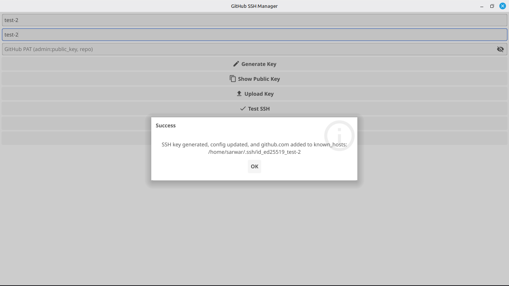
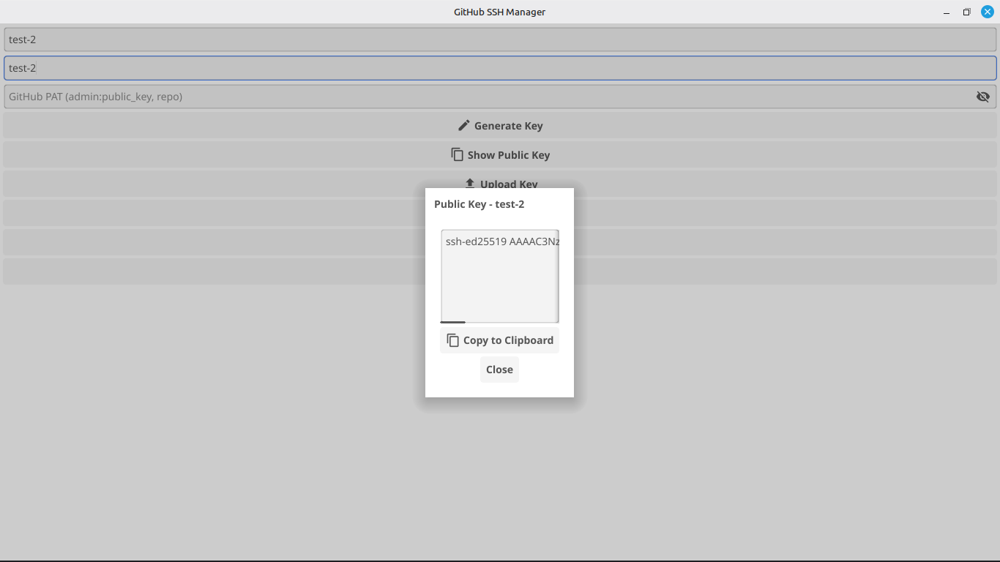
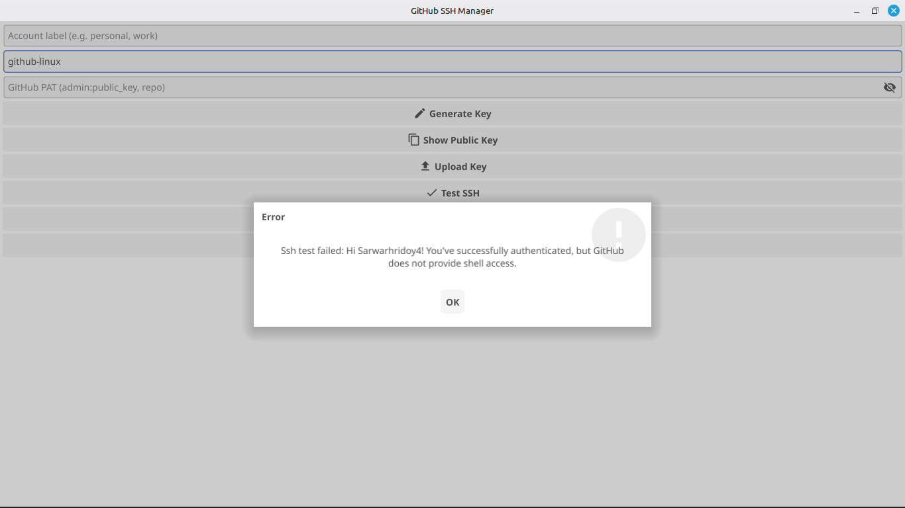
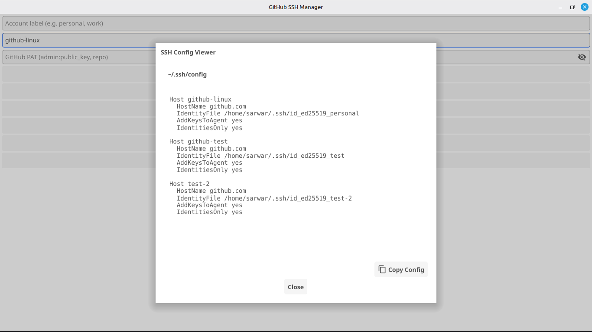
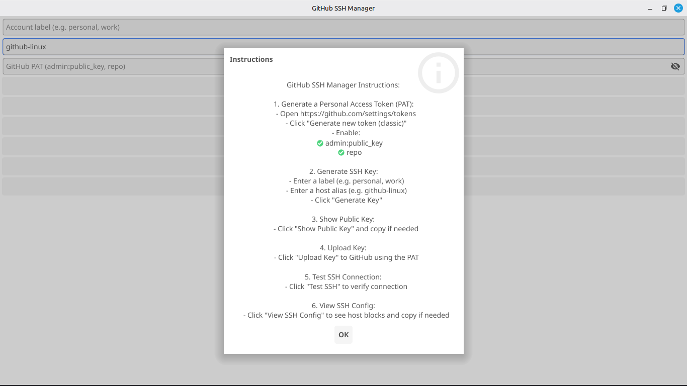

# GitHub SSH Manager

[](https://golang.org/)
[](LICENSE)
[](https://fyne.io/)
[](https://github.com/Sarwarhridoy4/github-ssh-manager)

A cross-platform GUI tool built with **Go** and **Fyne** that allows you to manage multiple GitHub SSH keys effortlessly. Generate keys, view public keys, upload to GitHub, test SSH connections, manage your `~/.ssh/config`, and track all operations with built-in activity logging—all from one place.

---

[](https://github.com/Sarwarhridoy4/github-ssh-manager/releases)

## 📌 Table of Contents

- [Features](#-features)
- [Screenshots](#️-screenshots)
- [Installation](#-installation)
  - [Linux (Debian/Ubuntu)](#linux-debianubuntu)
  - [Linux (AppImage)](#linux-appimage)
  - [macOS](#macos)
  - [Windows](#windows)
- [Running from Source](#️-running-from-source)
- [Building from Source](#-building-from-source)
- [Usage Instructions](#-usage-instructions)
- [Uninstallation](#️-uninstallation)
- [Dependencies](#️-dependencies)
- [Troubleshooting](#-troubleshooting)
- [License](#-license)

---

## ✨ Features

- **Generate SSH Keys** – Create `ed25519` SSH keys for multiple GitHub accounts
- **Show Public Key** – View and copy your public key to clipboard
- **Upload to GitHub** – Upload your public key via a Personal Access Token (PAT)
- **Test SSH Connection** – Verify SSH connection to GitHub for each account
- **View SSH Config** – Inspect your `~/.ssh/config` in a polished modal
- **Activity Logger** – Track all operations with timestamps and log levels
- **Export Logs** – Save activity logs to file for debugging or record-keeping
- **Multi-account Support** – Manage multiple GitHub accounts using custom labels
- **Cross-platform** – Works on Linux, macOS, and Windows
- **Built-in Help** – Step-by-step instructions accessible via the Help button

---

## 🖼️ Screenshots

### 1. Main Window


_Enter your label, host alias, and PAT, then generate or manage SSH keys easily._

### 2. Generate Key (Local with Config)



_Generate SSH KEY with automatic config file updates._

### 3. Public Key Viewer



_View your public key and copy it to clipboard._

### 4. Upload to GitHub with Personal Access Token (PAT Classic)

.png)

_Upload to GitHub with Personal Access Token (PAT Classic)._

### 5. SSH Connection Test (Success)



_SSH Connection test with successful authentication._

### 6. View SSH Config / Copy



_View and copy your SSH configuration._

### 7. Activity Logger & Export


_Track all operations with detailed logging and export capability._

### 8. Show Instructions / Help



_Comprehensive user instructions with clickable links._

---

## 📦 Installation

### Linux (Debian/Ubuntu)

Download the `.deb` package from the [releases page](https://github.com/Sarwarhridoy4/github-ssh-manager/releases).

#### Install

```bash
# Download the latest release (replace version number)
wget https://github.com/Sarwarhridoy4/github-ssh-manager/releases/download/v1.0.1/github-ssh-manager_1.0.1_amd64.deb

# Install the package
sudo dpkg -i github-ssh-manager_1.0.1_amd64.deb

# Fix dependencies if needed
sudo apt-get install -f
```

**Package Name:** `github-ssh-manager`

After installation, you can launch the app from your application menu or by running:

```bash
github-ssh-manager
```

#### Verify Installation

```bash
dpkg -l | grep github-ssh-manager
```

### Linux (AppImage)

AppImage is a universal Linux package that runs on most distributions without installation.

#### Download and Run

```bash
# Download the latest release
wget https://github.com/Sarwarhridoy4/github-ssh-manager/releases/download/v1.0.1/github-ssh-manager-1.0.1-x86_64.AppImage

# Make it executable
chmod +x github-ssh-manager-1.0.1-x86_64.AppImage

# Run the application
./github-ssh-manager-1.0.1-x86_64.AppImage
```

#### Extract Without FUSE

If you encounter FUSE errors, you can extract and run without FUSE:

```bash
# Extract the AppImage
./github-ssh-manager-1.0.1-x86_64.AppImage --appimage-extract

# Run the extracted binary
./squashfs-root/AppRun
```

**Note:** AppImages require FUSE to run normally. Install FUSE if needed:

```bash
sudo apt-get install fuse libfuse2
```

For more information, see [FUSE Documentation](https://github.com/AppImage/AppImageKit/wiki/FUSE).

### macOS

#### Using the App Bundle

```bash
# Download the .app bundle from releases
wget https://github.com/Sarwarhridoy4/github-ssh-manager/releases/download/v1.0.1/github-ssh-manager.app.zip

# Extract
unzip github-ssh-manager.app.zip

# Move to Applications folder
mv github-ssh-manager.app /Applications/

# Run
open /Applications/github-ssh-manager.app
```

**Note:** On first launch, you may need to allow the app in System Preferences > Security & Privacy.

### Windows

#### Using the Executable

```bash
# Download the .exe from releases
# Double-click to run or use command line:
github-ssh-manager.exe
```

**Note:** Windows Defender may show a warning on first run. Click "More info" → "Run anyway" if you trust the source.

---

## 🏃‍♂️ Running from Source

### Prerequisites

- **Go >= 1.22**
- **Git**
- **SSH tools** (`ssh-keygen`, `ssh`)
- **cURL** (for GitHub API uploads)
- **Fyne dependencies** (handled automatically via Go modules)

### Run from Source

```bash
git clone https://github.com/Sarwarhridoy4/github-ssh-manager.git
cd github-ssh-manager
go mod tidy
go run main.go
```

The GUI window will open, allowing you to manage your GitHub SSH keys.

---

## 💻 Building from Source

### Simple Build

#### Linux

```bash
GOOS=linux GOARCH=amd64 go build -o github-ssh-manager
```

#### macOS

```bash
GOOS=darwin GOARCH=amd64 go build -o github-ssh-manager
```

#### Windows

```bash
GOOS=windows GOARCH=amd64 go build -o github-ssh-manager.exe
```

### Production Build with Packaging

For production-ready packages with icons, metadata, and installer formats:

#### Install Build Tools

```bash
# Install Fyne CLI
go install fyne.io/tools/cmd/fyne@latest

# For Linux packages, also install:
sudo apt-get install dpkg-dev imagemagick wget fuse libfuse2
```

#### Automated Build Script (Linux)

We provide a comprehensive build script that creates both `.deb` and `.AppImage` packages:

```bash
# Make the script executable
chmod +x build.sh

# Run the build
./build.sh
```

This will create:
- `dist/github-ssh-manager_1.0.1_amd64.deb` - Debian package
- `dist/github-ssh-manager-1.0.1-x86_64.AppImage` - Universal Linux package
- `dist/SHA256SUMS` - Checksums for verification
- `dist/MD5SUMS` - MD5 checksums

#### Manual Packaging with Fyne

##### Linux

```bash
fyne package --os linux \
    --icon assets/icon.png \
    --name "GitHub SSH Manager" \
    --app-id "com.sarwarhridoy4.githubsshmanager" \
    --app-version 1.0.1 \
    --release
```

##### macOS

```bash
fyne package --os darwin \
    --icon assets/icon.png \
    --name "GitHub SSH Manager" \
    --app-id "com.sarwarhridoy4.githubsshmanager" \
    --app-version 1.0.1 \
    --release
```

##### Windows

```bash
fyne package --os windows \
    --icon assets/icon.png \
    --name "GitHub SSH Manager" \
    --app-id "com.sarwarhridoy4.githubsshmanager" \
    --app-version 1.0.1 \
    --release
```

#### Installing Locally (Development)

To install your development build system-wide:

```bash
fyne install --icon assets/icon.png
```

---

## 🔧 Usage Instructions

### 1. Generate a Personal Access Token (PAT)

1. Go to [GitHub Token Settings](https://github.com/settings/tokens)
2. Click **"Generate new token (classic)"**
3. Select the following scopes:
   - ✅ `admin:public_key` (read and write)
   - ✅ `repo` (optional, for private repos)
4. Generate and copy the token

### 2. Generate SSH Key

1. Enter an **account label** (e.g., `personal`, `work`, `company`)
2. Enter a **host alias** (e.g., `github-personal`, `github-work`)
3. Click **"Generate SSH Key"**
4. The key will be created at `~/.ssh/id_ed25519_<label>`

### 3. Show Public Key

1. Enter the label you used
2. Click **"Show Public Key"**
3. Copy the key to clipboard using the copy button

### 4. Upload Key to GitHub

1. Paste your Personal Access Token (PAT)
2. Click **"Upload to GitHub"**
3. Your public key will be uploaded with the title: `<label>-<host-alias>`

### 5. Test SSH Connection

1. Enter your host alias
2. Click **"Test SSH Connection"**
3. A successful connection will show: "Hi \<username\>! You've successfully authenticated..."

### 6. View SSH Config

1. Click **"View SSH Config"**
2. Review your `~/.ssh/config` file
3. Copy the entire config if needed

### 7. Activity Logs

- All operations are logged in the **Activity Log** section
- Logs include timestamps and severity levels (INFO, SUCCESS, ERROR, WARNING)
- Click **"Save Log"** to export logs to a file
- Click **"Clear Log"** to clear the current session logs

### 8. Help & Instructions

- Click **"Help & Instructions"** for detailed step-by-step guidance
- Includes a direct link to GitHub token settings

---

## 🗑️ Uninstallation

### Linux (Debian Package)

To uninstall the Debian package:

```bash
sudo dpkg -r github-ssh-manager
```

Or to remove completely including configuration files:

```bash
sudo dpkg --purge github-ssh-manager
```

Verify removal:

```bash
dpkg -l | grep github-ssh-manager
```

**Package Name:** `github-ssh-manager`

### Linux (AppImage)

Simply delete the AppImage file:

```bash
rm github-ssh-manager-1.0.1-x86_64.AppImage
```

If you extracted it:

```bash
rm -rf squashfs-root/
```

### macOS

```bash
# Remove from Applications
rm -rf /Applications/github-ssh-manager.app

# Remove preferences (optional)
rm -rf ~/Library/Preferences/com.sarwarhridoy4.githubsshmanager.plist
```

### Windows

1. Delete the executable file `github-ssh-manager.exe`
2. Remove any shortcuts you created

### Cleaning SSH Keys (All Platforms)

If you want to remove SSH keys created by the app:

```bash
# List keys created by the app
ls ~/.ssh/id_ed25519_*

# Remove specific key (replace <label> with your label)
rm ~/.ssh/id_ed25519_<label>
rm ~/.ssh/id_ed25519_<label>.pub

# Remove from GitHub (via web interface or API)
```

---

## 🛠️ Dependencies

### Runtime Dependencies

- **System SSH tools**: `ssh-keygen`, `ssh`, `ssh-keyscan`
- **cURL**: For GitHub API uploads
- **FUSE** (Linux AppImage only): For mounting AppImage files

### Build Dependencies

- [Go](https://golang.org/) >= 1.22
- [Fyne](https://fyne.io/) v2.6+
- [Fyne Tools](https://github.com/fyne-io/fyne) (for packaging)

### Go Module Dependencies

All Go dependencies are managed via `go.mod` and installed automatically:

```bash
go mod tidy
go mod download
```

Key modules:
- `fyne.io/fyne/v2` - GUI framework
- Standard library packages for crypto, networking, and file operations

---

## 🔍 Troubleshooting

### Linux: "dlopen(): error loading libfuse.so.2"

This error occurs when trying to run an AppImage without FUSE installed.

**Solution 1 - Install FUSE:**
```bash
sudo apt-get update
sudo apt-get install fuse libfuse2
```

**Solution 2 - Extract and Run:**
```bash
./github-ssh-manager-1.0.1-x86_64.AppImage --appimage-extract
./squashfs-root/AppRun
```

For more information: [FUSE Documentation](https://github.com/AppImage/AppImageKit/wiki/FUSE)

### Linux: Permission Denied when Installing .deb

Make sure you use `sudo`:
```bash
sudo dpkg -i github-ssh-manager_1.0.1_amd64.deb
```

### Linux: Dependency Issues After Installing .deb

Fix missing dependencies:
```bash
sudo apt-get install -f
```

### macOS: "App is damaged and can't be opened"

This is a Gatekeeper security feature. To allow the app:

```bash
# Remove quarantine attribute
xattr -d com.apple.quarantine /Applications/github-ssh-manager.app

# Or allow in System Preferences
# System Preferences > Security & Privacy > General > Open Anyway
```

### Windows: "Windows protected your PC"

This is Windows Defender SmartScreen. If you trust the source:

1. Click **"More info"**
2. Click **"Run anyway"**

### SSH Connection Test Fails

1. Verify the host alias matches what's in your `~/.ssh/config`
2. Ensure the public key is uploaded to GitHub
3. Check GitHub Settings > SSH and GPG keys
4. Test manually: `ssh -T git@<your-host-alias>`

### "Cannot read public key" Error

1. Verify you've generated the key first
2. Check the label matches exactly (case-sensitive)
3. Verify file exists: `ls ~/.ssh/id_ed25519_<label>.pub`

### Build Fails with "command not found: fyne"

Install Fyne CLI tools:
```bash
go install fyne.io/tools/cmd/fyne@latest
export PATH=$PATH:$(go env GOPATH)/bin
```

---

## 📝 Notes

- SSH keys are saved under `~/.ssh/id_ed25519_<label>`
- Public keys are named `~/.ssh/id_ed25519_<label>.pub`
- Host entries are automatically added to `~/.ssh/config`
- GitHub public key titles are formatted as: `<label>-<host-alias>`
- Activity logs are stored in memory and can be exported
- The app requires network access for GitHub API operations
- Minimum screen resolution: 800x600 (recommended: 1024x768+)

---

## 🤝 Contributing

Contributions are welcome! Please feel free to submit a Pull Request.

1. Fork the repository
2. Create your feature branch (`git checkout -b feature/AmazingFeature`)
3. Commit your changes (`git commit -m 'Add some AmazingFeature'`)
4. Push to the branch (`git push origin feature/AmazingFeature`)
5. Open a Pull Request

---

## 📄 License

This project is licensed under the **MIT License**. See the [LICENSE](LICENSE) file for details.

---

## 🙏 Acknowledgments

- [Fyne](https://fyne.io/) - The GUI toolkit that makes this possible
- [Go](https://golang.org/) - The programming language
- GitHub API for SSH key management
- The open-source community

---

## 📞 Support

- 🐛 **Bug Reports**: [GitHub Issues](https://github.com/Sarwarhridoy4/github-ssh-manager/issues)
- 💡 **Feature Requests**: [GitHub Issues](https://github.com/Sarwarhridoy4/github-ssh-manager/issues)
- 📖 **Documentation**: [GitHub Wiki](https://github.com/Sarwarhridoy4/github-ssh-manager/wiki)
- 💬 **Discussions**: [GitHub Discussions](https://github.com/Sarwarhridoy4/github-ssh-manager/discussions)

---

**Made with ❤️ by [Sarwar Hossain](https://github.com/Sarwarhridoy4)**